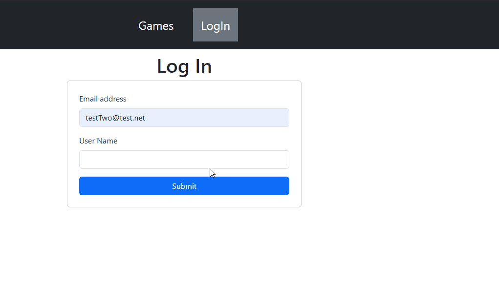
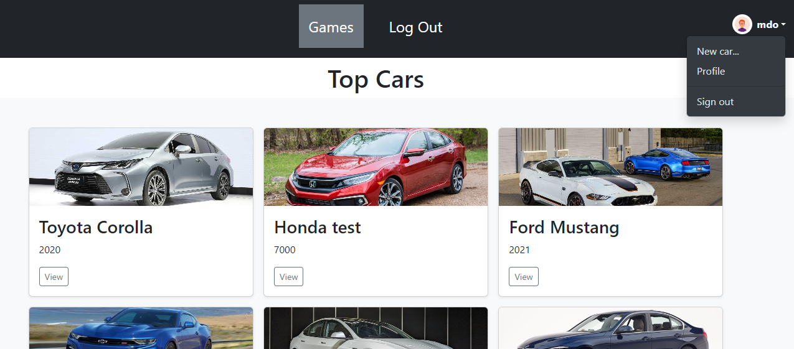

# Project Name: Car List Manager with Token Authentication

## Overview

Welcome to the GameList Manager repository! This project demonstrates how to create a game list management application that includes token-based authentication using an API. The front-end design is built with Bootstrap 5 for responsiveness and incorporates JavaScript to dynamically modify the game list. Users can view, add, edit, and delete games while authenticating seamlessly through tokens stored in the browser's local storage.

## Features

- **Responsive Design:** Built with Bootstrap 5, ensuring compatibility across various devices and screen sizes.

- **Token-Based Authentication:** Authenticate users using tokens stored in local storage, allowing for automatic login without passwords. This is particularly suited for private APIs with pre-approved users.

- **Car List Management:** View a list of games with details such as title, genre, release date, and platform.

  - View detailed information about games, including title, genre, release date, and platform.

  - Perform full CRUD (Create, Read, Update, Delete) operations on the game list.

- **Secure and Dynamic Operations:**

  - API integration to fetch and update data securely.
  - Dynamic updates to the UI without requiring a page refresh.

- **Form Validation:** Utilizes basic regular expressions to prevent invalid characters from being submitted through the web application.

## Technologies Used

- **_Bootstrap 5:_** Utilized for the responsive and modern user interface.

- **_JavaScript:_** Employs JavaScript for dynamic interactions and updates.

- **_RESTful API:_** Manages data securely and handles user authentication via tokens.

## Getting Started

### Prerequisites

- A modern web browser capable of running JavaScript and accessing local storage.

- Node.js and npm (if working with the backend API).

### Installation

- Clone this repository:
  `git clone https://github.com/web-rest-api/bootstrap-js-noDB/tree/part-05`

- Open the project in your preferred code editor.

- Clone the restful API:
  `https://github.com/web-rest-api/sqlite-queries`

- Install its dependencies

- Start the backend server: `npm start`

- You can seed the backend by running `node seed.js`. It will add some random data with two users that own some of the cars in order to allow them to edit their own cars

- Launch the index.html file in a web browser.

## Usage

- Log in using a pre-approved account. The system will validate your token with the backend API.

## Acknowledgments

- Bootstrap for providing an excellent front-end framework.
- JavaScript community for the dynamic scripting capabilities.
